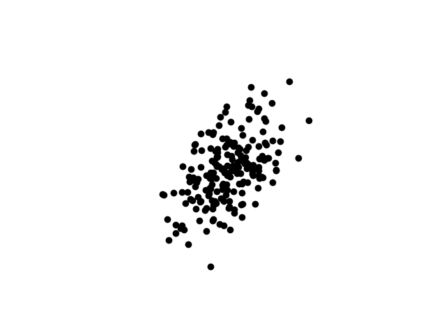
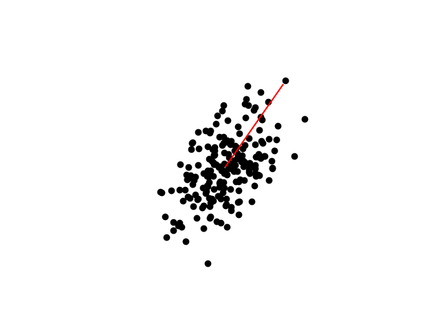
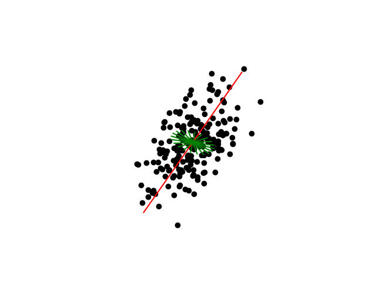
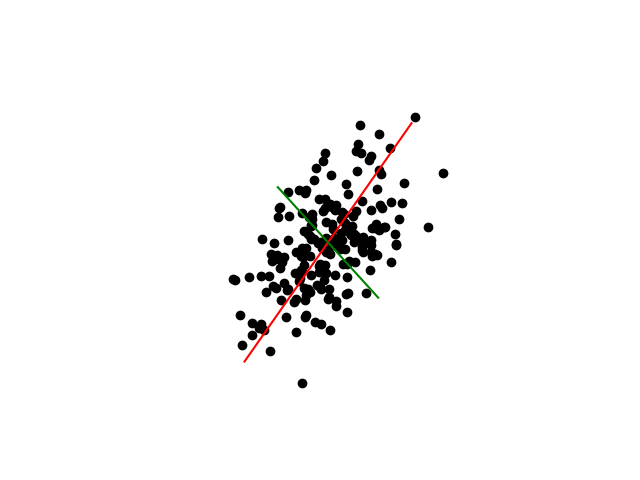
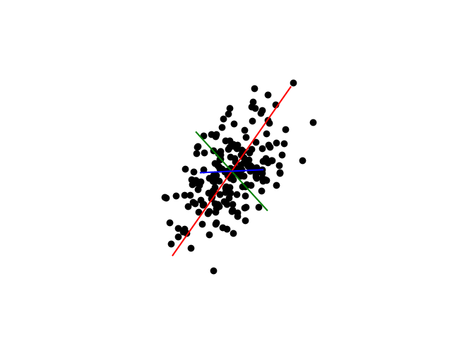
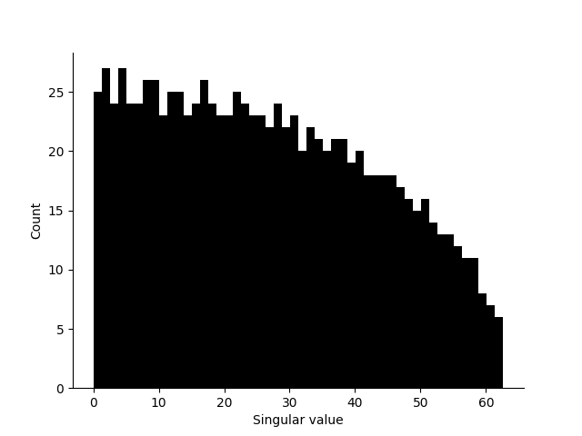
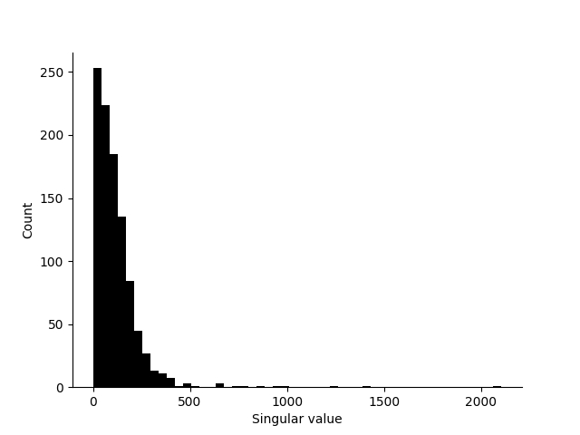

# Singular Value Decomposition and the Empirical Spectral Distribution
## SVD visualisation

> In this section, we will be working in `./svd_visualization.py` and `./coords_and_svd.py`. We are also using zero-based indexing, because I am a programmer.

SVD is a tool which allows you to find which dimensions in a dataset have a lot of variance. What does that actually mean? Let's take the following set of 200 points in 3D space;



Our data initially exists without any obvious coordinate system applied to it, and it's spinning through space. Or perhaps we're spinning around it; the two are identical from our perspective. The goal is impose a coordinate system onto this data in which the zeroth coordinate has the most variance, the next coordinate has the next most, et cetera. We can see that in our case, the data is pancake shaped, with more variance in one direction than others. Let's take that direction as our zeroth 'basis vector', that is the zeroth coordinate in the system that we are constructing.



What does this choice of basis vector mean in practise? It is chosen so that, if we were to pick one of our points in the data, simply knowing the closest point on this 1D line would give the best guess on where that point lies in the wider space. If we were to draw this line in a different direction, and there are infinitely many to choose from, we would have a worse guess. 

But even our mathematically optimal zeroth basis vector still can't yield a great guess, so how do we go about selecting another? Here, we can take advantage of a simple fact, our next basis vector has to be perpendicular to the zeroth. If it wasn't, there would be redundant information between the two basis vectors. This also arises from the fact that SVD computes a rotation, but that's a rabbit hole we can leave until later.

In 3D space, we still have an entire plane of vectors to choose from for our second basis vector.



We can, however, repeat a version of the same trick we applied to find the zeroth basis vector. We find the line which, knowing where the point sits on the zeroth basis vector, tells us the most about where the point is in 3D space.



Where do we go from here? Well, we are lucky enough to be living in a 3D space. In 3D space, given two vectors, there is only one vector perpendicular to both of them. Well, technically there are two (up and down) but they would simply yield an inverted sign. Let's apply that last basis vector now.



Because we have a 3D input space, and a 3D output space, knowing the closest point on all of these three basis vectors tells us where the data is in 3D space. SVD is sometimes used for a type of lossy compression known as dimensional reduction. If you were to flatten all the points so that you only knew their position relative to the zeroth and first basis vector, you could still have a pretty good guess of where the point is in 3D space while only having to communicate two values. 

You can also now see how SVD computes a rotation, essentially constructing a complete coordinate system for our data. 

Something to notice in this visualisation is that the basis vectors are not the same length. This is not true of the output of the raw SVD algorithm, which produces unit basis vectors, but here they are scaled by a set of another set of outputs of the SVD algorithm, the `S` values. These are technically known as the singular values, but I like to call them significance in my head. You can see that the zeroth is the highest significance, the first the next highest, and the final the least. If we had 100-Dimensional data, it would produce 100 perpendicular basis vectors with 100 significance levels, starting with the most end ending with the least significant.

> SVD is typically computed all at once rather than basis by basis, but this model is very useful in thinking about what exactly SVD is doing.

## Empirical Spectral Distribution

> In this section, we will be working in `./empirical_spectral_distribution.py` and `./coords_and_svd.py`.

How can we generalise this kind of analysis to higher than three spatial dimensions? The vector spaces become hard to visualise past 3 dimensions, but SVD remains useful. Let's focus on one type of analysis which can be performed, taking the Empirical Spectral Distribution (ESD). 

When we use numpy to compute the SVD in `coords_and_svd.py`, we get three cryptically named outputs;

```
U, S, Vh = np.linalg.svd(coords_world)
```

In reverse order:
 - `Vh` is a rotation matrix which we can use to align whatever input space we used to the space in which the zeroth dimension describes the highest variance, the first describes the next highest variance, et cetera. We can generate a set of vectors, apply any rotation we want, and SVD is generally guaranteed to converge the same output space. This is applied in the next line;

```
coords_world = np.matmul(coords_world, Vh)
```

- `S` contains the singular values (I call them 'significance' above). It's how long we portrayed our basis vectors to be in the last visualisation. For each of the basis vectors in Vh, it tells us how important they are to describing the variance of the data.
- Finally, `U` represents for each of our input points how much of each of our basis vectors we need to use to construct them. Unlike `Vh` and `S`, this part of the analysis is not aggregated and gives one output per input vector.

ESD analysis only considers the values of `S`, as this is a flat 1-dimensional vector. Remember, in the visualisation it was how much we scaled each of our basis vectors to show the influence of each. Let's take those scaled vectors and lay them flat, horizontal, and starting from the same X coordinate.


Now let's use that to build a histogram.


Et voila, we can see the worlds most pointless histogram. Because we only have three basis vectors to analyse, we have more buckets than we have values to fill them. Let's do something more interesting. Let's take 1000 uncorrelated vectors, each with 1000 dimensions and see how our histogram of singular values look. Lets say that each of the values in this collection of vectors are normally distributed with mean 0 and variance 1.



And here is the magic of the ESD; we can take a vector space far too large to be reasoned about visually, but still make meaningful conclusions about the structure of the underlying space. There is clearly a pattern here, and we can treat it as a distribution and use all of the tools of statistics to analyse what's going on.

ESD analysis is usually introduced towards the beginning of a course on Random Matrix Theory (RMT), surrounded by derivations and notation. While those are vital, there also is a real risk of leaving such a course without any intuitive sense of what's actually going on inside of these operations and spaces. In particular, RMT has led to recent breakthroughs in describing the internal structure of a neural network with tools like [WeightWatcher](https://github.com/CalculatedContent/WeightWatcher). Neural networks are composed mostly of fancy matrix multiplications after all, and ESD analysis has shown an unreasonable level of generality in understanding how they work. It can do this without looking at training data or even knowing their intended purpose. Incidentally, my cookies have not recovered since discovering WeightWatcher.

I have a confession to make; I have shown you the most boring type of ESD that exists. We've used a mathematical tool designed to measure correlation and structure to look at a matrix without any of either. The ESD distribution that we saw above in the uncorrelated and normally distributed case is called the Marchenko–Pastur (MP) law. If we take another distribution, like standard Student's T distribution with degrees of freedom < 2, we get something a lot prettier;



The variance of the ESD here follows a Power Law, which can be seen from all of those singular values hanging out on their own at the very high end. Generally, in neural networks, the specific type and shape of the power law can tell you a lot about how the layers of your networks are training.

### Further Reading:

 - [Traditional and Heavy-Tailed Self Regularization in Neural Network Models](https://arxiv.org/abs/1901.08276) (Martin & Mahoney, 2019)
 - [WeightWatcher](https://github.com/CalculatedContent/WeightWatcher) on GitHub
