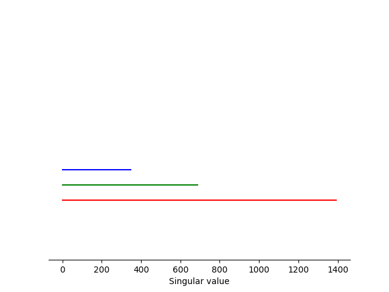
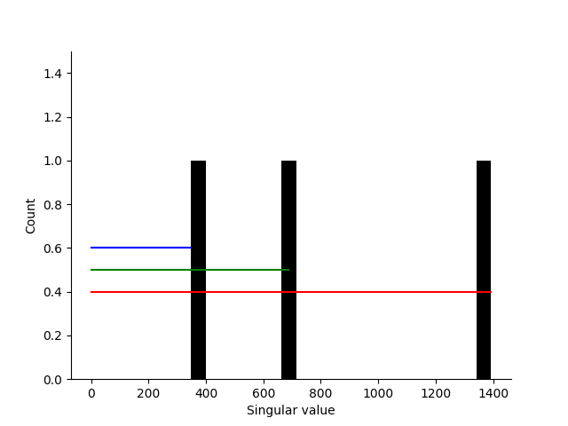
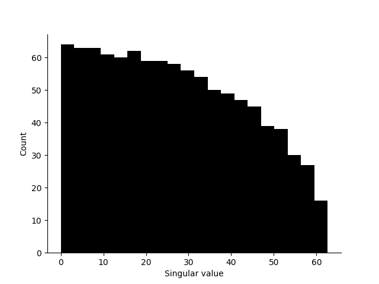

## Singular Value Decomposition vizualisation

`./svd_visualization.py` is a tool to help wrap your head around what exactly the SVD does by explaining it as rotation, in this case in 3D space;

 - Our data initially exists without any obvious coordinate system applied to it, and it's spinning freely through space. We can see that the data is pancake shaped, with a lot more variance in one axis than the other two.


 - When the first boolean flag (`add_basis`) is flipped to true, we see a set of three basis vectors which would represent our coordinate system. but our data is still unconstrained by it.


 - When the second boolean flag (`constrain_first_axis`) is flipped to true, we see that the direction of maximum variance has been constrained to the first (red) basis vector, but it is still free to rotate around the other two.


 - When the third boolean flag (`constrain_second_axis`) is flipped to true, we see that all rotation has been removed. We have set the second basis vector to the one perpundicular to the first basis vector which describes the highest remaining variance.


 - The Third basis vector, therefore, takes up any variance not explained by the first two as we have no more dimensions left to play with.
 -  When the fourth boolean flag is flipped (`scale_basis_by_significance`), we see how much variance is explained by each basis.


Although SVD is not typically computed basis-by-basis, this mental model scales to higher dimensions and I found it very useful in understanding what exactly is going on.

## Empirical Spectral Distribution

How can we generalise this kind of analysis to higher than three spatial dimensions? The vector spaces become hard to visualise in 3D space, but remains meaningful. Let's focus on one type of analysis which can be perfomed, taking the Empirical Spectral Distribution (ESD). 

When we use numpy to compute the SVD in `coords_and_svd.py`, we get three cryptically named outputs;

```
U, S, Vh = np.linalg.svd(coords_world)
```

In reverse order:
 - `Vh` is a rotation matrix which we can use to align whatever input space we used to the space in which the zeroth dimension describes the highest variance, the first describes the next highest variance, et cetera. We can generate a set of vectors, apply any rotation we want, and SVD is generally guaranteed to converge the same output space. This is applied in the next line;

```
coords_world = np.matmul(coords_world, Vh)
```

- `S` contains the singular values (I call them 'significance' above). It's what how long we portrayed our basis vectors to be in the last visualisation. For each of the basis vectors in Vh, it tells us how important they are to describing the variance of the data.
- Finally, `U` represents, for each of our input points, how much of each of our basis vectors we need to use to recover them. Unlike `Vh` and `S`, this part of the analysis is not aggregated and gives one output per input vector.

ESD analysis only considers the values of `S`, as this is a flat 1-dimensional vector. Remember, it's how much we scaled each of our basis vectors by in our visualisation to show the influence of each on the visualisation. Let's take those scaled vectors and lay them flat, horizontal, and staring from the same X coordinate.



Now let's use that to build a historgram.



Et voila, we can see the worlds most pointless histogram. Because we only have three basis vectors to analyse, we have more buckets than we have values to fill them. Let's do something more interesting. Let's take 1000 uncorrelated vectors, each with 1000 dimensions and see how our histogram of singular values look. Lets say that each of the values in this collection of vectors are normally distributed with mean 0 and variance 1.



And here is the magic of the ESD; we can take a vector space far too large to be reasoned about visually, but still make meaningful conclusions about the structure of the underlying space. There is clearly a statistical pattern here, and we can treat it as a statistical distribution and use all of the tools of statistics to analyse what's going on.

